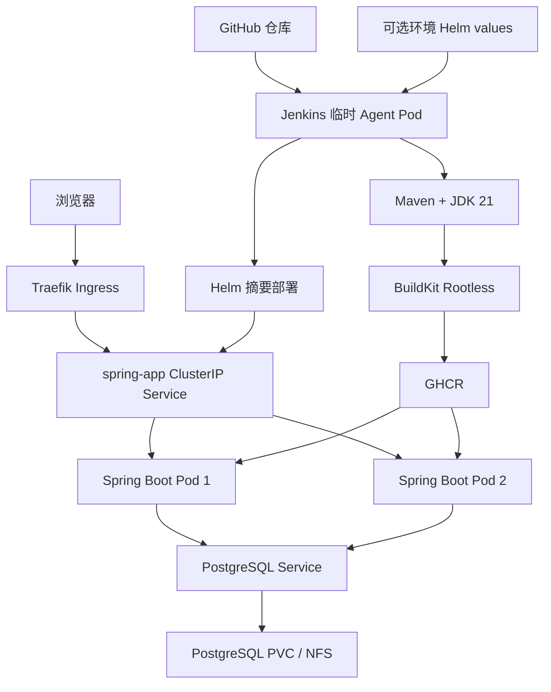

# K8S-Deploying-Java

一个用于演示 Java 21、Spring Boot 3、PostgreSQL、Jenkins 和 Kubernetes 完整部署链路的示例项目。

项目对应《Kubernetes 中部署 Jenkins、Spring Boot 3 与 PostgreSQL》方案。Jenkins 使用临时 Kubernetes Agent 完成 Maven 构建和测试，BuildKit Rootless 制作镜像并推送到 GHCR，Helm 使用镜像摘要把两个 Spring Boot Pod 部署到 Kubernetes。

## 1. 项目目标

本项目重点验证下面几件事：

1. Spring Boot 3 应用可以使用 Java 21 构建并在非 root 容器中运行。
2. Traefik、Kubernetes Service 和两个应用 Pod 可以完成请求负载分发。
3. 页面可以显示实际响应请求的 Pod 名称、Pod IP 和所在节点。
4. 两个应用 Pod 可以共同读写同一个 PostgreSQL 数据库。
5. 数据支持新增、查询、修改、删除和后端分页。
6. 应用 Pod 重建后，记录仍保存在 PostgreSQL 持久卷中。
7. Jenkins 可以完成测试、打包、BuildKit Rootless 镜像构建、GHCR 推送和 Helm 部署。

这是教学和实验项目，不是生产高可用方案。PostgreSQL、Jenkins 和 NFS 在配套方案中仍然是单副本或单点服务。

## 2. 功能说明

### 2.1 Pod 负载均衡观察

页面顶部显示本次请求对应的：

- Pod 名称
- Pod IP
- Kubernetes 节点名称
- 后端响应时间

点击“刷新实例”会重新调用 `/api/instance`。接口和浏览器请求都禁用缓存，因此多次刷新时可以观察 Traefik 在两个 Spring Boot Pod 之间分发请求。

### 2.2 数据库记录管理

每条记录包含标题、内容和创建时间，支持：

- 添加记录
- 修改记录
- 删除记录，删除前二次确认
- 按创建时间和 ID 倒序显示
- 选择每页 5、10、20 或 50 条
- 首页、上一页、下一页和末页导航

分页查询和总数统计由数据库与 Spring Data JPA 完成，浏览器不会一次读取全部记录。

## 3. 技术栈

| 部分 | 技术或版本 |
| --- | --- |
| 项目版本 | 1.0.9 |
| Java | OpenJDK 21 |
| 应用框架 | Spring Boot 3.5.16 |
| 构建工具 | Maven |
| Web | Spring MVC、原生 HTML/CSS/JavaScript |
| 参数校验 | Jakarta Bean Validation |
| 数据访问 | Spring Data JPA、Hibernate |
| 数据库 | PostgreSQL 17 |
| 表结构管理 | Flyway |
| 健康检查 | Spring Boot Actuator |
| 自动化测试 | JUnit 5、MockMvc、H2 PostgreSQL 兼容模式 |
| 代码覆盖率 | JaCoCo |
| 镜像构建 | BuildKit Rootless |
| 镜像仓库 | GitHub Container Registry |
| Kubernetes 部署 | Helm、Traefik Ingress |
| Jenkins 共享类库 | `jenkins-json-build@v3.2.0` |

## 4. 总体架构



应用本身是无状态的。Pod 身份由 Kubernetes Downward API 注入，业务数据全部保存到 PostgreSQL，因此请求落到任一 Pod 都能看到同一批记录。

## 5. 程序详细设计

### 5.1 分层设计

| 层次 | 主要类或文件 | 职责 |
| --- | --- | --- |
| 启动层 | `K8sDeployingJavaApplication` | 启动 Spring Boot 并加载配置属性 |
| 实例信息 | `InstanceInfoController`、`InstanceInfoService` | 读取 Pod 名称、IP、节点名并提供禁止缓存的查询接口 |
| 接口层 | `DemoRecordController` | 接收 HTTP 请求、校验分页参数并设置响应状态码 |
| 业务层 | `DemoRecordService` | 处理字符串规范化、记录查找、事务和默认排序 |
| 数据访问层 | `DemoRecordRepository` | 使用 Spring Data JPA 执行 PostgreSQL 查询和分页 |
| 数据模型 | `DemoRecord` | 映射 `demo_records` 表 |
| 输入输出模型 | `DemoRecordRequest`、`DemoRecordResponse`、`PagedResponse` | 隔离接口数据和数据库实体 |
| 错误处理 | `GlobalExceptionHandler` | 统一返回校验错误、资源不存在和服务器错误 |
| 数据库迁移 | `V1__create_demo_records.sql` | 由 Flyway 创建表和索引 |
| 页面 | `index.html`、`app.css`、`app.js` | 显示实例、提交表单、编辑删除和分页 |

### 5.2 Pod 信息流程

1. Helm Deployment 使用 Downward API 把 `metadata.name`、`status.podIP` 和 `spec.nodeName` 注入容器。
2. Spring Boot 将环境变量绑定到 `app.instance` 配置。
3. `/api/instance` 返回当前实例数据和服务器响应时间。
4. 接口响应包含 `Cache-Control: no-store`，页面请求同时附带唯一时间参数。
5. 本地运行没有 Kubernetes 环境变量时，程序自动读取本地主机名和地址。

### 5.3 记录写入流程

1. 浏览器把标题和内容以 JSON 提交到后端。
2. Bean Validation 检查必填项和长度。
3. 业务层去除标题和内容首尾空格。
4. JPA 在事务中写入 PostgreSQL。
5. 后端返回新记录，页面回到第一页并重新读取列表。

标题最长 100 个字符，内容最长 1000 个字符。页面使用 `textContent` 显示数据库内容，不把用户输入作为 HTML 执行。

### 5.4 修改和删除流程

- 修改时，页面把选中记录放回表单并发送 `PUT /api/records/{id}`。
- 删除时，页面先要求确认，再发送 `DELETE /api/records/{id}`。
- 修改或删除不存在的 ID 时返回 `404 NOT_FOUND`。
- 删除某页最后一条数据后，页面自动返回前一页，避免停留在空白页。

### 5.5 分页设计

- 页码从 `0` 开始。
- 默认每页 10 条。
- 每页最少 1 条、最多 50 条。
- 排序固定为 `created_at DESC, id DESC`，相同创建时间下结果仍然稳定。
- 返回内容包括当前页、每页条数、总记录数、总页数、是否首页和是否末页。

### 5.6 健康检查

- `/actuator/health/liveness` 只判断应用进程是否存活，不依赖数据库。数据库暂时中断时不会导致 Kubernetes 不断重启应用。
- `/actuator/health/readiness` 包含数据库检查。数据库不可用时 Pod 会退出 Service 流量。
- Helm 同时配置 startup、readiness 和 liveness Probe。

### 5.7 错误响应

统一错误格式如下：

```json
{
  "code": "VALIDATION_FAILED",
  "message": "提交内容不符合要求",
  "fieldErrors": {
    "title": "标题不能为空"
  },
  "timestamp": "2026-08-09T10:00:00Z"
}
```

服务器内部异常只记录到服务日志，不向浏览器返回 Java 堆栈。

## 6. 项目目录

```text
K8S-Deploying-Java/
├── ci/
│   ├── jenkins-agent.yaml        # Maven、BuildKit、Helm 三容器临时 Agent
│   ├── jenkins-project.json      # V3 流水线、镜像和 Helm 参数
│   └── prepare-helm-values.sh    # 准备可选环境 Helm values
├── deploy/charts/spring-app/
│   ├── templates/
│   │   ├── configmap.yaml        # Spring Profile 和 JVM 运行参数
│   │   ├── deployment.yaml       # 两副本应用、Secret、Probe、Pod 信息
│   │   ├── ingress.yaml          # Traefik HTTPS Ingress
│   │   └── service.yaml          # ClusterIP Service
│   ├── Chart.yaml
│   └── values.yaml
├── src/main/java/com/sunweisheng/k8sdeployingjava/
│   ├── config/                   # 配置属性
│   ├── demo/                     # 记录 CRUD 和分页
│   ├── instance/                 # Pod 实例信息
│   ├── web/                      # 统一错误响应
│   └── K8sDeployingJavaApplication.java
├── src/main/resources/
│   ├── db/migration/             # Flyway PostgreSQL 迁移
│   ├── static/
│   │   ├── css/app.css
│   │   ├── js/app.js
│   │   └── index.html
│   ├── application-k8s.yml
│   └── application.yml
├── src/test/                     # 接口、CRUD、分页和迁移测试
├── .dockerignore
├── .gitignore
├── Dockerfile
├── Jenkinsfile
├── pom.xml
└── README.md
```

## 7. API 说明

| 方法 | 地址 | 说明 | 成功状态 |
| --- | --- | --- | --- |
| GET | `/api/instance` | 查询当前响应 Pod | `200` |
| GET | `/api/records?page=0&size=10` | 分页查询记录 | `200` |
| POST | `/api/records` | 添加记录 | `201` |
| PUT | `/api/records/{id}` | 修改指定记录 | `200` |
| DELETE | `/api/records/{id}` | 删除指定记录 | `204` |
| GET | `/actuator/health/liveness` | Kubernetes 存活检查 | `200` |
| GET | `/actuator/health/readiness` | Kubernetes 就绪检查 | `200` 或 `503` |

新增和修改使用相同的请求结构：

```json
{
  "title": "Kubernetes 测试",
  "content": "这条数据由 Spring Boot Pod 写入 PostgreSQL。"
}
```

分页响应结构：

```json
{
  "content": [],
  "page": 0,
  "size": 10,
  "totalElements": 0,
  "totalPages": 0,
  "first": true,
  "last": true
}
```

## 8. PostgreSQL 建表语句

项目正常启动时由 Flyway 自动执行 `src/main/resources/db/migration/V1__create_demo_records.sql`。下面是完整建表语句，便于审查和排查数据库；不要在已经由 Flyway 管理的同一个 Schema 中再次手工执行。

```sql
CREATE TABLE demo_records (
    id BIGINT GENERATED BY DEFAULT AS IDENTITY PRIMARY KEY,
    title VARCHAR(100) NOT NULL,
    content VARCHAR(1000) NOT NULL,
    created_at TIMESTAMP WITH TIME ZONE NOT NULL DEFAULT CURRENT_TIMESTAMP
);

CREATE INDEX idx_demo_records_created_at_id
    ON demo_records (created_at DESC, id DESC);
```

应用使用 `spring.jpa.hibernate.ddl-auto=validate`。Hibernate 只校验实体与表结构，不负责修改数据库。

## 9. 配置项

| 环境变量 | 必填 | 来源 | 说明 |
| --- | --- | --- | --- |
| `SPRING_DATASOURCE_URL` | 是 | 本地环境或 `app-db` Secret | PostgreSQL JDBC 地址 |
| `SPRING_DATASOURCE_USERNAME` | 是 | 本地环境或 `app-db` Secret | 数据库用户名 |
| `SPRING_DATASOURCE_PASSWORD` | 是 | 本地环境或 `app-db` Secret | 数据库密码 |
| `DB_POOL_MAX_SIZE` | 否 | 环境变量 | 最大连接数，默认 10 |
| `DB_POOL_MIN_IDLE` | 否 | 环境变量 | 最小空闲连接数，默认 2 |
| `POD_NAME` | Kubernetes 注入 | Downward API | 当前 Pod 名称 |
| `POD_IP` | Kubernetes 注入 | Downward API | 当前 Pod IP |
| `NODE_NAME` | Kubernetes 注入 | Downward API | Pod 所在节点 |
| `SPRING_PROFILES_ACTIVE` | Kubernetes 注入 | ConfigMap | Kubernetes 中使用 `k8s` |
| `JAVA_TOOL_OPTIONS` | Kubernetes 注入 | ConfigMap | JVM 时区等运行参数 |

数据库密码、GHCR Token、Jenkins 密码和 TLS 私钥不能写入本仓库。

## 10. 本地开发

### 10.1 使用 Homebrew JDK 21

本机已经安装 Homebrew OpenJDK 21，但旧 Java 可能仍在 PATH 前面。每次构建前检查：

```bash
export JAVA_HOME=$(/usr/libexec/java_home -v 21)
export PATH="$JAVA_HOME/bin:$PATH"

java -version
javac -version
mvn -version
```

三个命令都应显示 Java 21。

### 10.2 准备数据库连接

先在本地 PostgreSQL 中创建数据库和用户，然后设置连接信息。密码通过终端交互读取，不写入 shell 历史：

```bash
export SPRING_DATASOURCE_URL='jdbc:postgresql://127.0.0.1:5432/k8s_demo'
export SPRING_DATASOURCE_USERNAME='k8s_demo'
read -r -s "SPRING_DATASOURCE_PASSWORD?PostgreSQL 密码: "
export SPRING_DATASOURCE_PASSWORD
echo
```

启动应用：

```bash
mvn spring-boot:run
```

浏览器访问 `http://localhost:8080/`。应用首次连接数据库时，Flyway 自动创建表和索引。

### 10.3 测试和打包

```bash
mvn clean verify
java -jar target/app.jar
```

测试使用内存 H2 的 PostgreSQL 兼容模式，不需要本地 PostgreSQL。`verify` 完成后生成：

- 可执行程序：`target/app.jar`
- JUnit 报告：`target/surefire-reports/`
- JaCoCo 报告：`target/site/jacoco/`

直接运行 JAR 时仍然必须提供三个数据库环境变量。

## 11. 容器镜像

Maven 先生成 `target/app.jar`，Dockerfile 只制作运行镜像，不在镜像中重复执行 Maven：

```bash
mvn clean package
docker build -t spring-app:local .
```

运行容器使用 Eclipse Temurin JRE 21，并以 UID/GID `10001` 运行。Kubernetes 中同时启用只读根文件系统，只有 `/tmp` 使用临时卷。

Dockerfile 使用标准 OCI source 标签关联 `https://github.com/sunweisheng/K8S-Deploying-Java`。BuildKit 首次推送 GHCR Package 后，GitHub 可以根据该标签自动关联源码仓库，不需要人工执行 `Connect repository`。

## 12. Jenkins 流水线

`Jenkinsfile` 只固定共享类库版本并指定 JSON：

```groovy
@Library('jenkins-json-build@v3.2.0') _

jenkinsJsonBuild(configFiles: ['ci/jenkins-project.json'])
```

流水线按下面顺序执行：

1. 创建包含 Maven、BuildKit 和 Helm 的临时 Agent Pod。
2. Maven 使用 JDK 21 执行测试和打包。
3. BuildKit Rootless 构建镜像并推送到 `ghcr.io/sunweisheng/spring-app`。
4. BuildKit 把远程缓存写入 GHCR。
5. 共享类库从结构化 metadata JSON 中校验 `sha256` 镜像摘要。
6. Helm 容器准备环境覆盖 values；没有覆盖配置时生成空 values 文件。
7. Helm 使用该摘要执行 Chart lint、模板渲染并安装或升级 `spring-app` Release。
8. 构建结束后删除临时 Agent Pod。

项目 JSON 只允许 `main` 分支执行镜像推送和 Helm 部署；Jenkins 页面仍应配置相同的分支过滤，避免创建无用途的功能分支任务。流水线依赖配套部署攻略中已经创建的：

- 仅包含 `main` 分支的 Multibranch Pipeline 分支过滤规则
- `jenkins-json-build@v3.2.0` 全局共享类库
- 仅供 BuildKit 使用的 `build-proxy` ConfigMap；Maven 直接访问 Maven Central，不读取该代理配置
- `ghcr-push-config` Secret
- `jenkins-deployer` ServiceAccount 和最小部署权限
- `spring-app` 命名空间
- 可选的 `ci/deploy-overrides` ConfigMap；不创建时直接使用项目 Chart 默认值

Jenkins Chart `5.9.49` 启用 `agent.restrictedPssSecurityContext=true` 后，Kubernetes plugin 会给所有容器补充 `runAsNonRoot: true` 等受限安全字段，但不会补充数字 `runAsUser` 和 `runAsGroup`。插件先合并 Pipeline YAML，再自动增加 `jnlp`，最后注入受限安全字段，因此项目不能伪造同名容器，必须由 Pod 级数字身份覆盖自动注入的 `jnlp`。

项目 Agent Pod 通过 `POD_RUN_AS_USER`、`POD_RUN_AS_GROUP` 和 `POD_FS_GROUP` 在 `spec.securityContext` 中设置数字身份，Maven 与 Helm 再显式声明相同身份。`jnlp` 没有容器级 UID 时会继承 Pod 级数字 UID，从而通过 kubelet 的非 root 预校验。Pod `fsGroup` 同时保障 Jenkins 工作区和 `emptyDir` 可写。Maven 的 `MAVEN_USER_HOME`、`MAVEN_CONFIG`、`MAVEN_REPOSITORY` 以及 Helm 的 `HELM_USER_HOME` 均固定到 `/home/jenkins` 下的可写路径，不再依赖 root 用户目录。

BuildKit 继续使用独立的 Rootless、`1000:1000`、Unconfined 和 `--oci-worker-no-process-sandbox` 配置。RootlessKit 启动时需要镜像内的 `newuidmap/newgidmap` 建立 subordinate UID/GID 映射，因此 BuildKit 容器显式使用 `allowPrivilegeEscalation: true`，并在 `drop: ALL` 后只加回 `SETUID` 和 `SETGID`。否则 Jenkins 的 `restrictedPssSecurityContext` 会让 BuildKit 报 `operation not permitted`。这项例外只属于 BuildKit；Maven、Helm、`jnlp` 和应用容器都不获得相同权限，BuildKit 也没有使用 `privileged: true`、Docker Socket 或 `hostPath`。

虚拟机环境中的 `build-proxy` 只挂载到 BuildKit 容器，用于访问 Docker Hub 和 GHCR。Maven 容器不注入 `HTTP_PROXY`、`HTTPS_PROXY`、`NO_PROXY`，也不挂载自定义 `settings.xml`，而是直接访问 Maven Central。云服务器方案仍可保留空的 `build-proxy` ConfigMap，以满足同一份 Agent YAML 的 BuildKit `configMapKeyRef`。

安装 Jenkins 时，`jenkins-values.yaml` 仍应为 Chart 自带的默认 PodTemplate 配置相同身份：

```yaml
agent:
  restrictedPssSecurityContext: true
  runAsUser: 1000
  runAsGroup: 1000
```

Chart 的 `agent.runAsUser/runAsGroup` 只作用于 Chart 自带的默认 PodTemplate，Pipeline 使用 `podTemplate(yaml: ...)` 创建的动态 Pod 不会可靠继承这两个值。因此它们不能代替项目 YAML 中的 Pod 级数字身份。

`spring-app` 命名空间由管理员在平台初始化阶段预先创建。项目把 Helm upgrade 的 `createNamespace` 明确设为 `false`，避免最小权限的 `jenkins-deployer` 在首次安装时尝试创建集群级 Namespace；不要为此给部署身份增加 Namespace 创建权限。

Surefire 在启动测试 JVM 时预加载 Mockito Java Agent，并保留 JaCoCo 的覆盖率参数。这项配置避免 JDK 21 在禁止 JVM 动态附加的本机或 CI 环境中因 Byte Buddy 自附加失败而中断测试。

## 13. Helm 部署

Chart 默认配置同时用于本地检查和未提供环境覆盖配置的 Jenkins 部署：

- Release：`spring-app`
- Namespace：`spring-app`
- 副本数：2
- Service：`ClusterIP:8080`
- Ingress：`app.k8s.lab`
- IngressClass：`traefik`
- 数据库 Secret：`app-db`
- GHCR 拉取 Secret：`ghcr-pull-config`
- Spring Profile：`k8s`

Helm Agent Pod 会尝试挂载 `ci` 命名空间中的可选 `ConfigMap/deploy-overrides`。ConfigMap 不存在时，`prepare-helm-values.sh` 生成内容为 `{}` 的空 values 文件，Helm 因而保留上面的 Chart 默认值。需要环境差异时，在 ConfigMap 的 `values.yaml` 中写标准 Helm 局部配置；写了哪一项就只覆盖哪一项。例如云环境同时覆盖域名和 TLS Secret：

```yaml
apiVersion: v1
kind: ConfigMap
metadata:
  name: deploy-overrides
  namespace: ci
data:
  values.yaml: |
    ingress:
      host: app.cloud.k8s.lab
      tlsSecret: k8s-cloud-lab-tls
```

如果只需要改变域名，可以只保留 `ingress.host`；如果只需要改变 TLS Secret，可以只保留 `ingress.tlsSecret`，二者没有绑定关系。环境 values 在 Chart 默认值之后合并，流水线的镜像仓库和经过校验的镜像摘要再通过 `setValues` 覆盖，因此环境 ConfigMap 不会改变本次构建要部署的镜像。

提交前检查 Chart。镜像摘要由 Jenkins 正式注入，本地检查时使用格式正确的临时摘要：

```bash
helm lint deploy/charts/spring-app \
  --set-string image.repository=ghcr.io/sunweisheng/spring-app \
  --set-string image.digest=sha256:aaaaaaaaaaaaaaaaaaaaaaaaaaaaaaaaaaaaaaaaaaaaaaaaaaaaaaaaaaaaaaaa

helm template spring-app deploy/charts/spring-app \
  --namespace spring-app \
  --set-string image.repository=ghcr.io/sunweisheng/spring-app \
  --set-string image.digest=sha256:aaaaaaaaaaaaaaaaaaaaaaaaaaaaaaaaaaaaaaaaaaaaaaaaaaaaaaaaaaaaaaaa \
  > /tmp/spring-app-rendered.yaml
```

手工部署已经推送的镜像时：

```bash
HELM_DRIVER=configmap helm upgrade --install spring-app deploy/charts/spring-app \
  --namespace spring-app \
  --set-string image.repository=ghcr.io/sunweisheng/spring-app \
  --set-string image.digest='sha256:替换为真实镜像摘要' \
  --wait \
  --timeout 5m
```

应用 Release 由 Jenkins 使用 ConfigMap 保存发布记录，因此手工执行 `upgrade`、`history`、`status` 或 `rollback` 时也必须设置 `HELM_DRIVER=configmap`，不能与默认 Secret Driver 混用。

## 14. Kubernetes 验收

查看应用资源：

```bash
kubectl -n spring-app get deployment,pod,service,ingress -o wide
kubectl -n spring-app rollout status deployment/spring-app
kubectl -n spring-app logs deployment/spring-app --tail=200
```

两个 Pod 都应为 `Running` 且 `READY 1/1`。

连续调用实例接口，确认至少出现两个不同的 Pod：

```bash
for request_number in 1 2 3 4 5 6 7 8 9 10; do
  curl -sk https://app.k8s.lab:30443/api/instance
  echo
done
```

随后通过页面完成下面的检查：

1. 添加超过一页的记录并切换分页。
2. 修改一条记录，刷新页面后确认修改保留。
3. 删除一条记录，确认总数和分页同步更新。
4. 刷新实例，确认不同 Pod 看到相同数据库记录。
5. 删除一个应用 Pod，等待 Deployment 创建新 Pod，再确认记录仍然存在。

## 15. 安全和范围说明

- PostgreSQL 只使用 ClusterIP，不直接暴露到局域网。
- 应用只通过 Traefik Ingress 对外提供访问。
- 数据库和 Registry 凭据只通过 Kubernetes Secret 注入。
- BuildKit 不挂载 Docker Socket，也不使用特权容器。
- 应用容器使用非 root 用户、只读根文件系统并删除 Linux capabilities。
- 应用 Pod 不挂载默认 ServiceAccount Token，不访问 Kubernetes API。
- 页面没有登录和权限控制，只适合受控实验网络。
- 删除操作是真实数据库删除，不提供回收站。
- H2 只用于自动化测试；实际运行和最终验收必须使用 PostgreSQL。
